.. _lti:

########################
Using Chirun through LTI
########################

The Chirun web frontend is an `LTI 1.3 tool <http://www.imsglobal.org/activity/learning-tools-interoperability>`__. 

You can use this tool to link to and manage material from your learning environment.

************************
Registering the LTI tool
************************

Registering to use the LTI tool with your virtual learning environment is currently a manual process.

We're in the process of establishing how to offer use of the Chirun LTI tool to users outside Newcastle University.
If you'd like to be involved, please `email us <mailto:msp.digital.learning@ncl.ac.uk?subject=Chirun%20LTI%20use>`__.

***************
Creating a link
***************

======
Canvas
======

This video shows how to add Chirun content to your course.
There's a text version of the instructions below the video.

.. raw:: html

    <iframe src="https://player.vimeo.com/video/868725431?h=4a602f95ed" width="640" height="360" frameborder="0" allow="autoplay; fullscreen; picture-in-picture" allowfullscreen></iframe>

----------------
Choosing content
----------------

A Chirun package can contain several items, or just one.
Items can be grouped into parts.

You might like to link to each item individually from Canvas, to fit with the structure of your course, or just link to the whole package and allow students to find their own way through the notes.
Or you could do both!

--------------------
Adding a new package
--------------------

To begin with, you'll have to create or upload a package to the Chirun server.

In your course's Modules page, click the :guilabel:`+` icon to start adding a new item to a module.

Select :guilabel:`External tool`, and then :guilabel:`Embed Chirun material`.

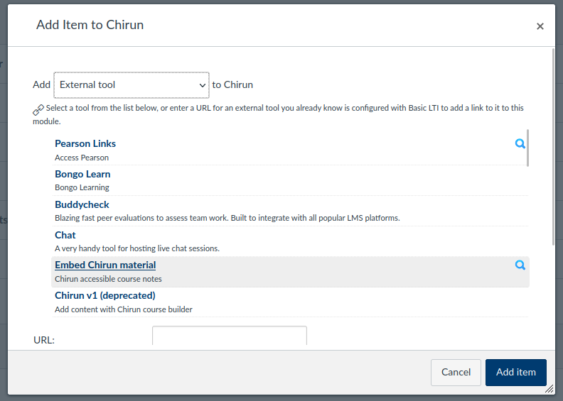

A box pops up, containing the Chirun interface.

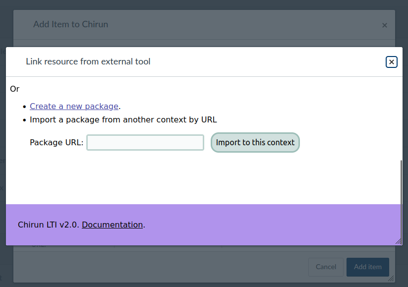

Click :guilabel:`Create a new package`.

On the next page is a form where you can upload any source files that you have.
Or if you're starting from scratch, you can leave the input empty and just click :guilabel:`Submit`.
I've selected an existing LaTeX file, :file:`notes.tex`.

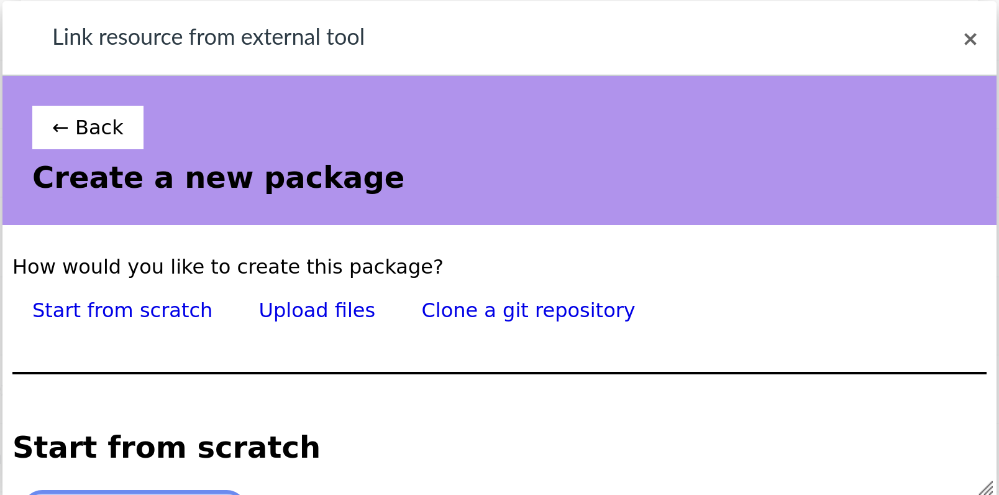

The package must be configured and built before you can use it.
Click the link :guilabel:`Edit or build this package`.

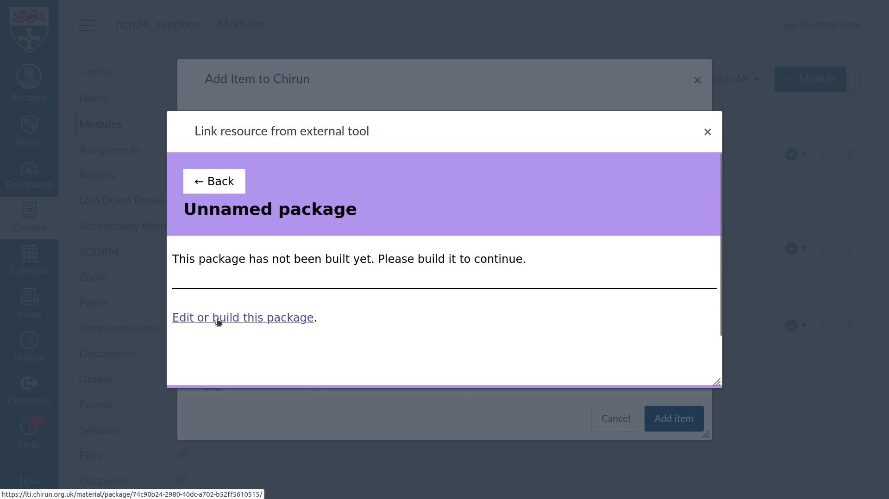

You're shown the editing interface for the package in a new tab.
Click the :guilabel:`Configure` link.

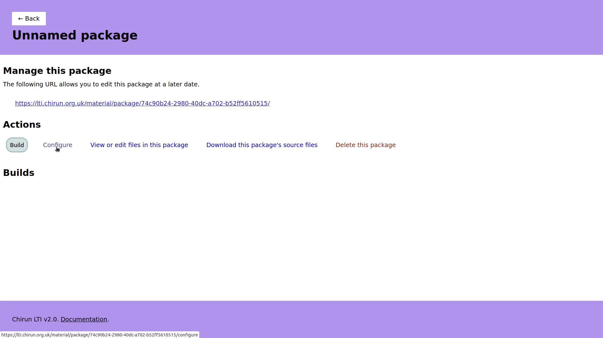

Fill in the package metadata fields.

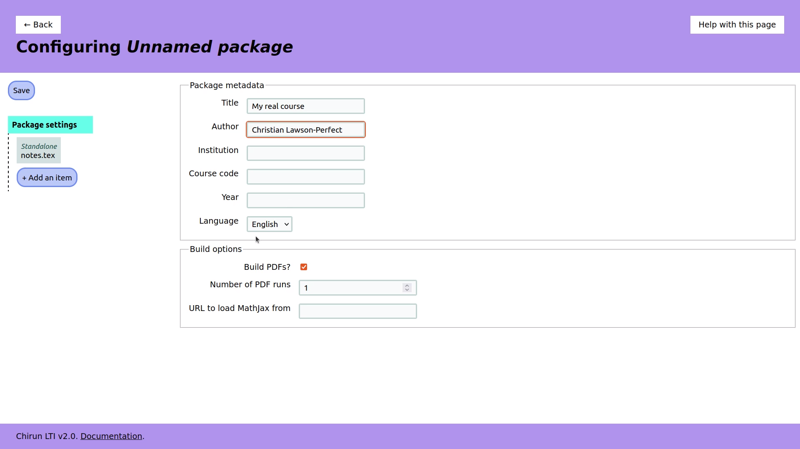

Because I uploaded a single LaTeX file, it's been added to the configuration as a standalone item.
Click on its entry in the left sidebar, and fill in its title.
Students see this title, so use a title that describes the content of the document.

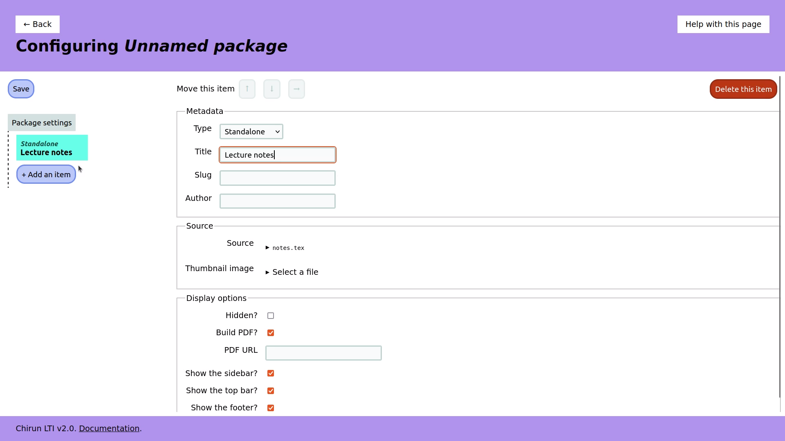

Click the :guilabel:`Save` button.
The package will be built.
Once that's done, go back to the Canvas tab.
The page has updated to show that the package has been built.
Click on :guilabel:`Pick an item to use`.

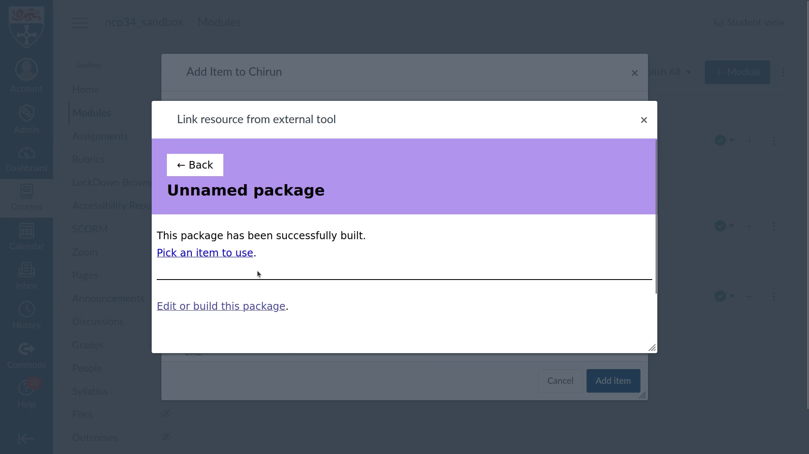

You're shown a list of items in the package.
There's only one in this package, so click on it.

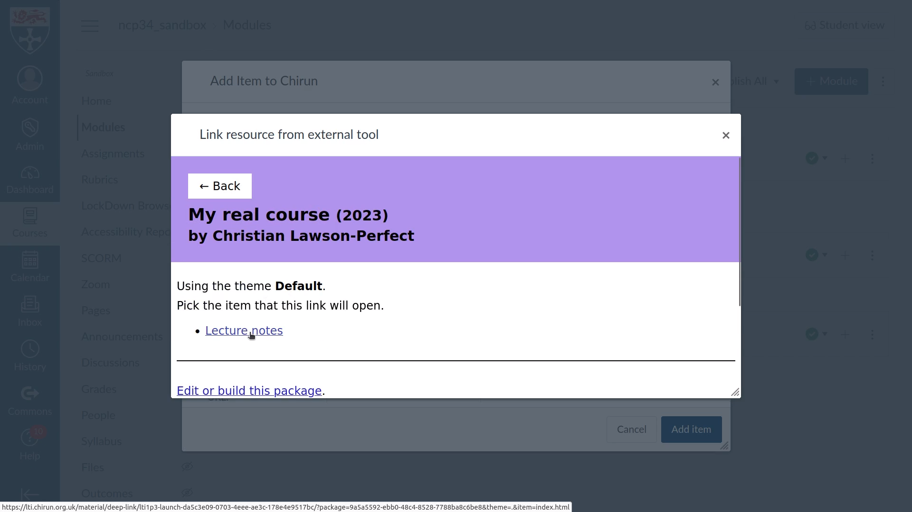

You're shown a very small preview of the chosen item.
Click :guilabel:`Use this choice` to confirm it's the one you want.

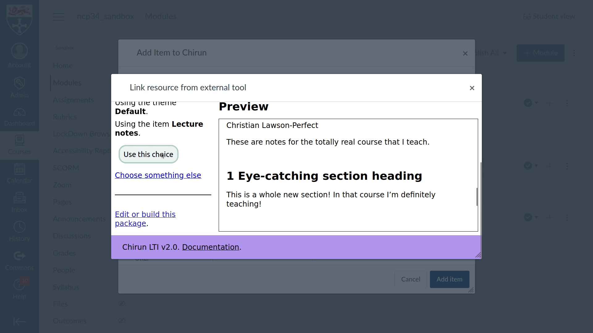

You're returned to the Canvas "Add Item" box.
Click on :guilabel:`Add item`.

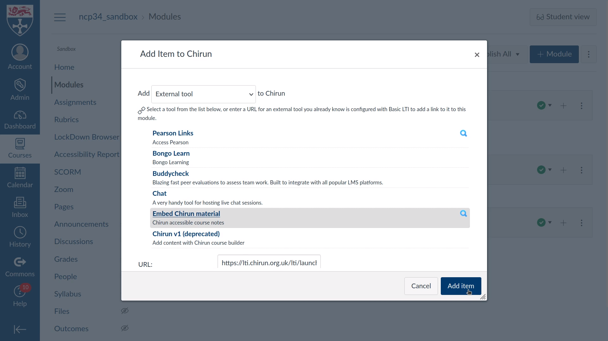

-----------------------
Using existing material
-----------------------

Once a package has been used once in your course, it's available from the initial "add item" menu for easy access.

.. image:: _static/images/select-package-existing.png
   :alt: A dialog box containing a list of package titles, followed by a link "Create a new package", and a form labelled "Import a package from another context by URL".

I've picked Sample Course.
It contains several items, split into parts.
I select Beamer Slides.

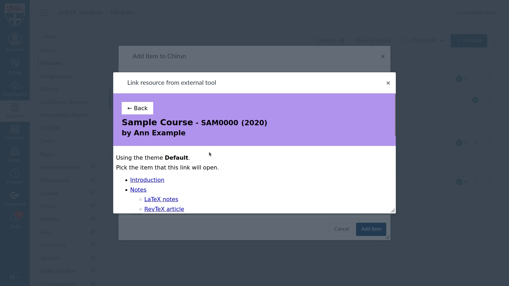

You can choose how to display slides: in the default format, as a continuous page, or as slides.

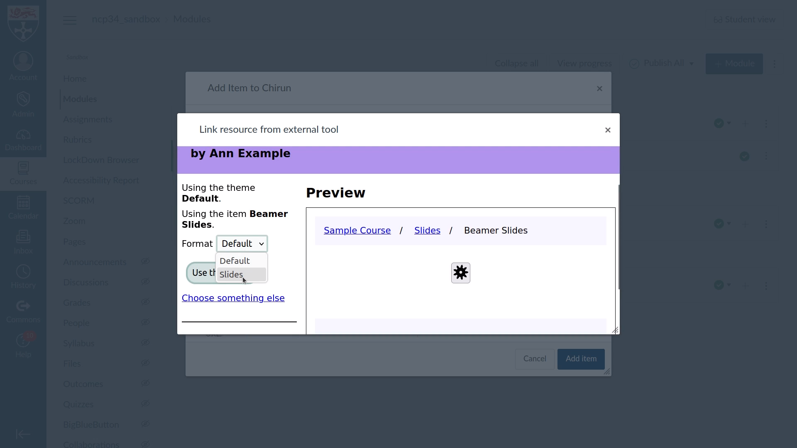

This determines which format students are shown when they click on the link; they can change to another format afterwards.

======
Moodle
======

In Moodle, select the Chirun activity type, or "external tool", and select the Chirun preconfigured tool.

Click :guilabel:`Select content`.
A modal frame opens.

You can see all packages linked to this context.

You can select a linked package to use, create a new package, or import a package created in another context by giving its :ref:`management URL <package-management-url>`.

Once you've selected a package, if it offers more than one theme, you're asked to pick a theme.

Then you must pick an item.
When the student opens this link, they will see the item you select.
They may be able to navigate to other parts of the package, depending on how the item is configured.

If the item is available in more than one HTML format, then you must finally pick the format to use.

Click :guilabel:`Use this choice` to confirm your choice.
You'll be returned to your learning environment.
